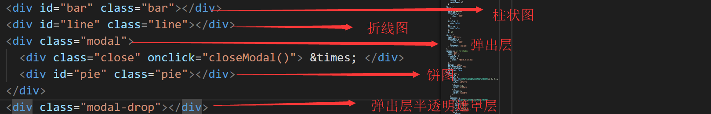

# 文档说明

## 参考文档 

[百度ECharts](http://echarts.baidu.com/option.html) ``` 可能打开较慢，耐心等待 ```  

## 项目代码

[chartsDemo](https://github.com/Timer-Q/chartsDemo.git)

## 目录结构
<pre>
|- js
|  |-- echarts.common.min.js     // echarts依赖js
|  |-- jquery-3.2.1.min.js       // jquery
|- testData
|  |-- date.js                   // 获取日期、随机数等
|- index.html                    // 入口文件
</pre>

## html

   

* 在index.html中引入js文件，先引入jquery后引入，echarts；
* 图片是charts的dom结构，样式很简单，设置一下宽高就行，在index.html的style标签里面；

## js

### 柱状图配置信息

>1、生成echarts实例：  
- var barChart = echarts.init(document.getElementById('bar'));   

2、设置配置信息  
- options={}   

3、使用刚指定的配置项和数据显示图表。
- barChart.setOption(option);

4、点击事件
- 直接用charts实例.on
<pre>
    lineChart.on('click', function (params) {
      document.querySelector('.modal').style.display = 'block'
      pieChart.showLoading()
      var waies = ['餐饮', '网购', '缴费', '百货', '充值']
      $.ajax({
        type: 'get',
        async: true,
        url: 'http://userpay.icitic.net/user/orderListQuery',
        dataType: 'json',
        success: function (res) {
          setPieData(params, pieOptions, pieChart, waies, params.name + '前五名支出项')
        }
      })
    })
</pre>


